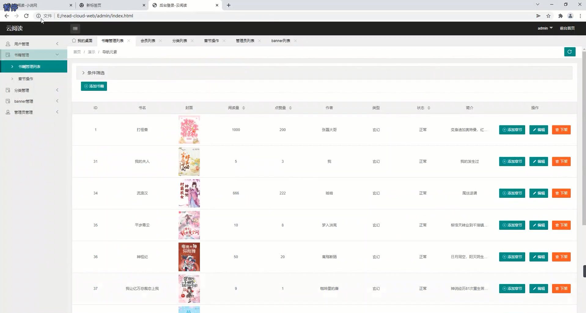
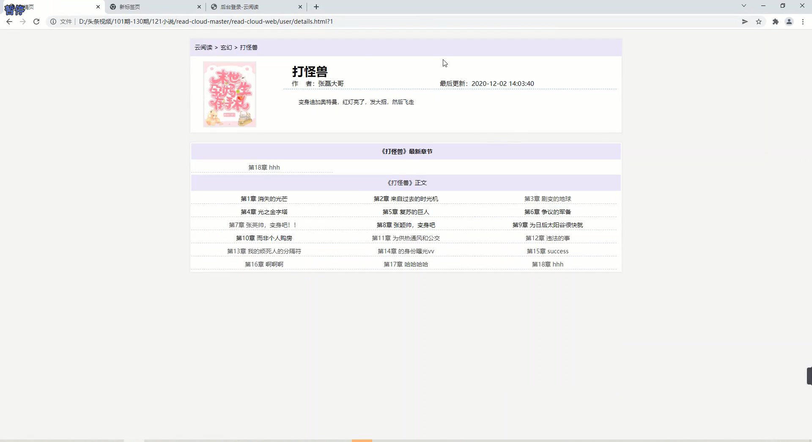
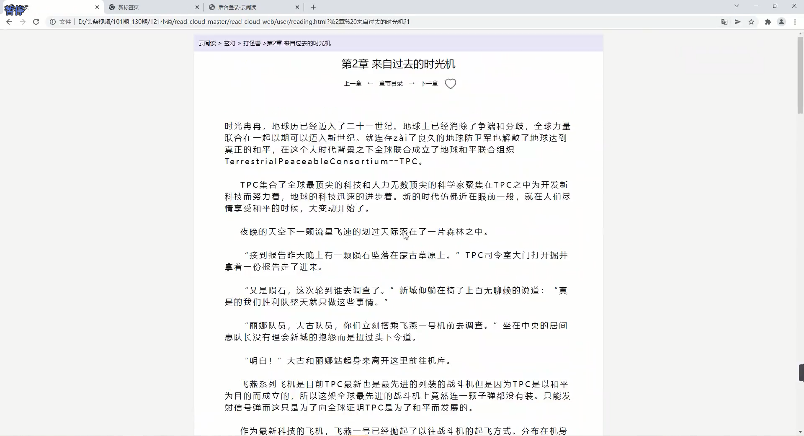
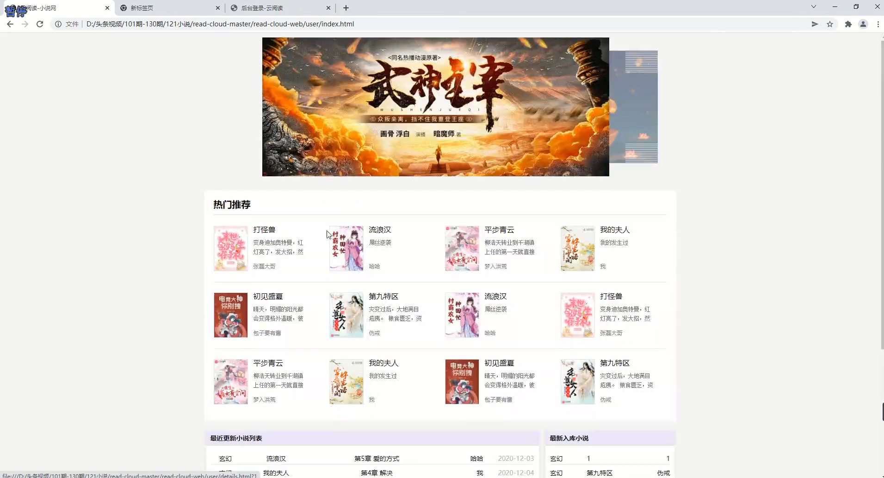
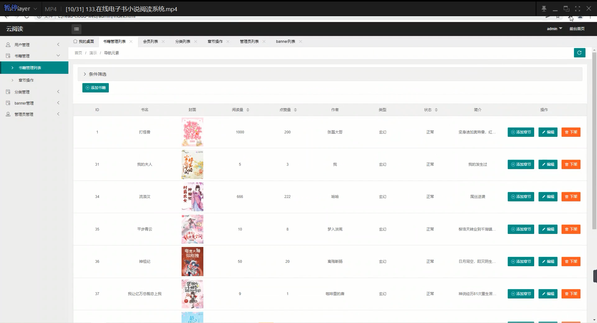

基于Springboot的在线电子书小说阅读系统
=
### 完整代码获取地址：从戎源码网 ([https://armycodes.com/](https://armycodes.com/))
### 作者微信：19941326836  QQ：952045282 
### 承接计算机毕业设计、Java毕业设计、Python毕业设计、深度学习、机器学习
### 选题+开题报告+任务书+程序定制+安装调试+论文+答辩ppt 一条龙服务
### 所有选题地址https://github.com/nature924/allProject

一、项目介绍
---
基于Spring Boot框架实现的在线电子书小说阅读系统，系统包含三种角色：管理员、用户，顾问主要功能如下。
### 【用户功能】
1. 首页：查看系统主要信息和最新动态。
2. 公告：浏览系统发布的公告信息。
3. 顾问：浏览可提供咨询服务的顾问列表。
4. 健康知识：获取系统提供的健康知识信息。
5. 个人中心：管理个人信息。

### 【管理员功能】
1. 系统首页：查看系统整体情况和关键信息。
2. 个人中心：管理管理员的个人信息。
3. 管理员管理：维护系统管理员的账户信息。
4. 基础数据管理：管理系统的基础数据。
5. 公告管理：发布、编辑和管理系统的公告信息。
6. 顾问管理：管理可提供咨询服务的顾问信息。
7. 用户咨询管理：查看和管理用户的咨询信息。
8. 顾问预约管理：处理用户对顾问的预约请求。
9. 健康知识管理：发布、编辑和管理健康知识信息。
10. 用户管理：维护系统用户的账户信息。
11. 轮播图信息：管理系统首页轮播图的展示内容。

二、项目技术
---
- 编程语言：Java
- 数据库：MySQL
- 项目管理工具：Maven
- 前端技术：VUE、HTML、Jquery、Bootstrap
- 后端技术：Spring、SpringMVC、MyBatis

三、运行环境
---
- 操作系统：Windows、macOS都可以
- JDK版本：JDK1.8以上都可以
- 开发工具：IDEA、Ecplise、Myecplise都可以
- 数据库: MySQL5.7以上都可以
- Tomcat：任意版本都可以
- Maven：任意版本都可以

四、运行截图
---

### 程序截图：

